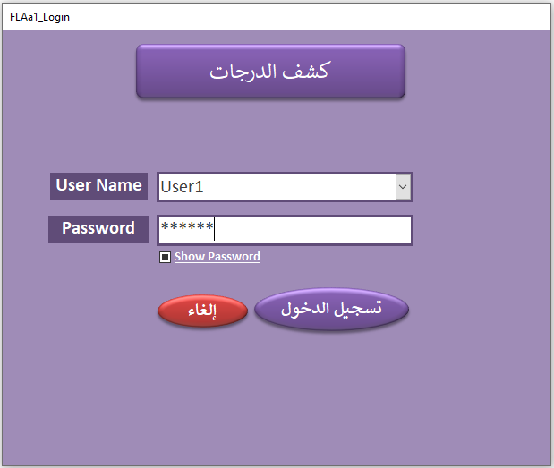

<h2 align="center">1- شهادة الطالب</h2>

  يتم تسجيل الصف الدراسى. ثم يتم تسجيل بيانات الطلاب. ثم يتم تسجيل المواد الدراسية. ثم يتم إدخال تسجيل دراسى لكل طالب. داخل التسجيل الدراسى يتم تحديد درجات الطالب فى المواد المختلفة

<h3 align="center">
  عرض فيديو استخدام قاعدة البيانات من اليوتيوب
   
  <a href="https://www.youtube.com/watch?v=HjK7GhNMsro">https://www.youtube.com/watch?v=HjK7GhNMsro</a>
</h3>

<h3 align="center">
  صور قاعدة البيانات
</h3>

  
  
  
  
  
  
  
  
  
  
 
 
  

