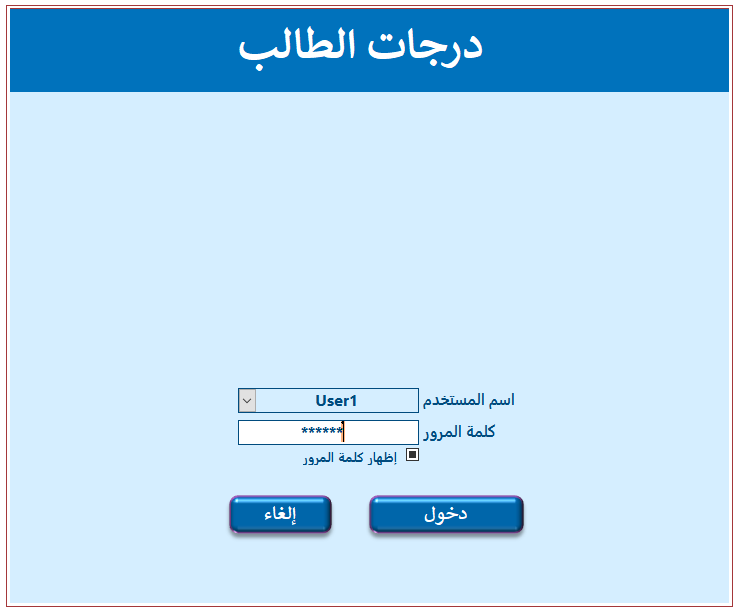
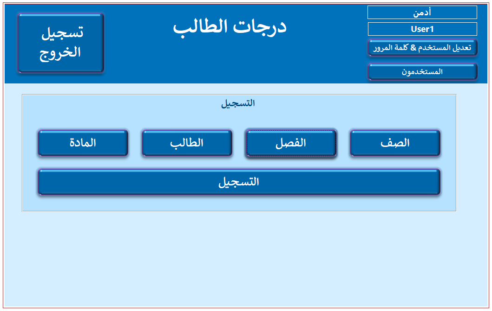
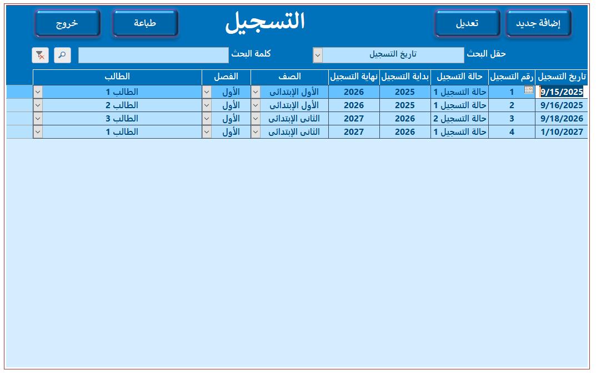
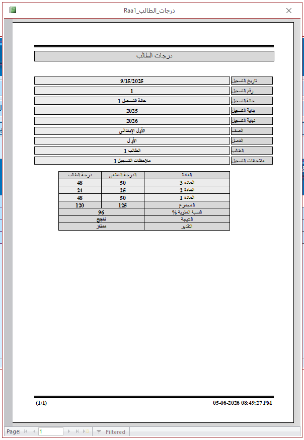

<h2 align="center">1- درجات الطالب</h2>

  يتم تسجيل الصف والفصل والطالب والمادة. ثم يتم إدخال تسجيل دراسى لكل طالب لتحديد الصف والفصل والسنة الدراسية. داخل التسجيل الدراسى يتم تحديد درجات الطالب فى كل مادة

<h3 align="center">
  عرض فيديو استخدام قاعدة البيانات من اليوتيوب
   
  <a href="https://www.youtube.com/watch?v=2bgf0_uYpHY">https://www.youtube.com/watch?v=2bgf0_uYpHY</a>
</h3>

<h3 align="center">
  صور قاعدة البيانات
</h3>

  
  
  
  
  
  
 
 
  

