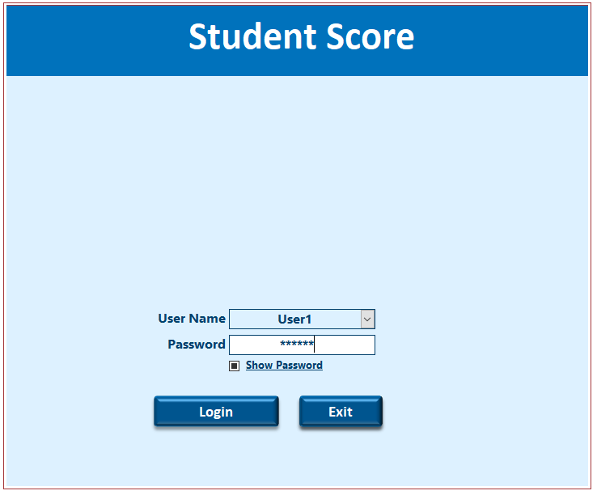
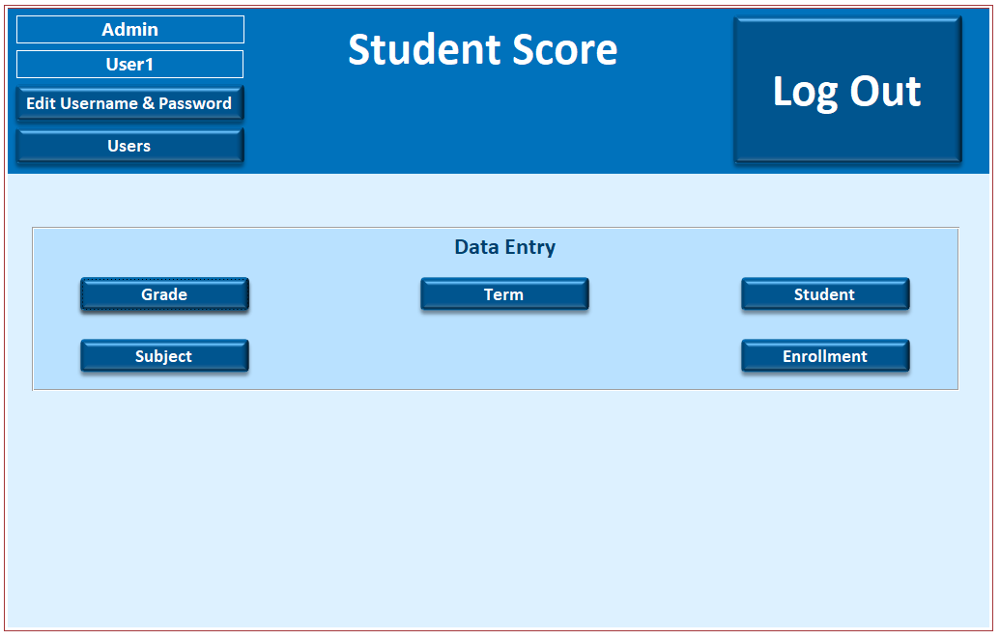
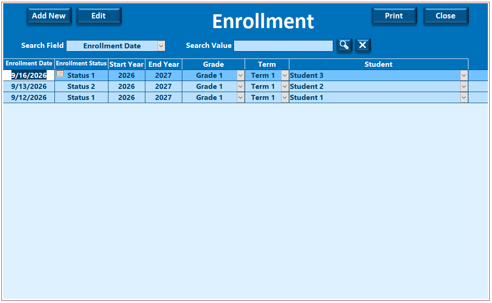
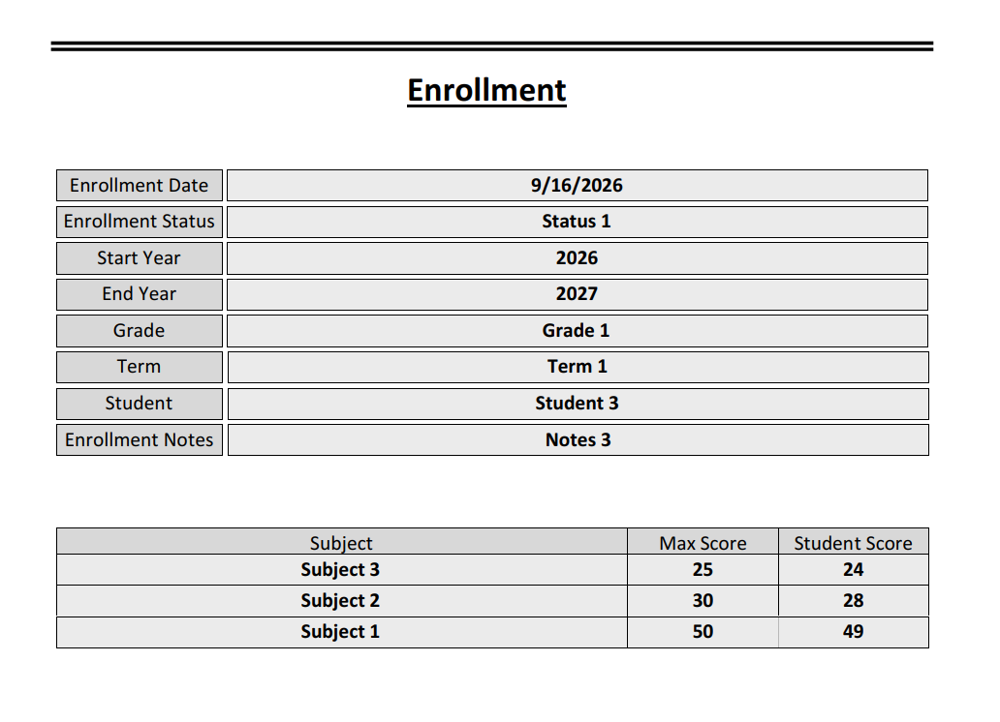

<h2 align="center">1b- Student Score</h2>

Grade, Term, Student and Subject lists are added. Then Student are enrolled according to academic year, grade and term. Subjects and their scores are added on each enrollment record

<h3 align="center">
Download Source File
    
  <a href="/1b_Student_Score_English/Source_Files/003_Student_Score_En_LD.accdb">Student_Score_En_LD</a>
</h3>

<h3 align="center">
Preview Database on YouTube
    
  <a href="https://www.youtube.com/watch?v=lRRnxbiOE_I&t=240s">https://www.youtube.com/watch?v=lRRnxbiOE_I&t=240s</a>
</h3>

<h3 align="center">
    Database Images
</h3>

  
  
  
  
  
  
 
 
  

