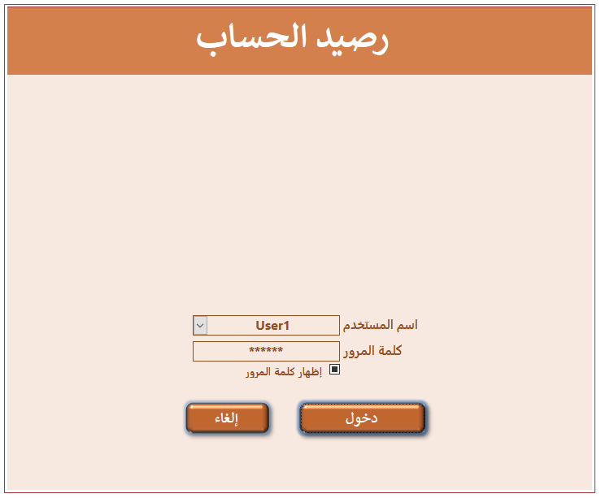
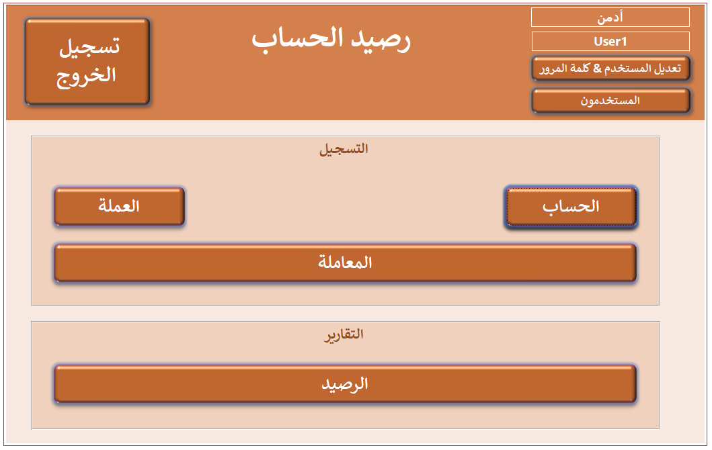
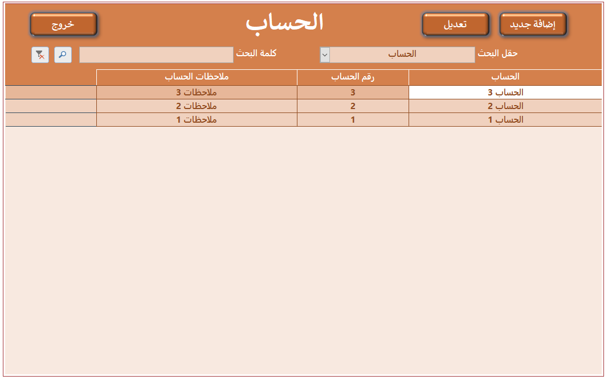
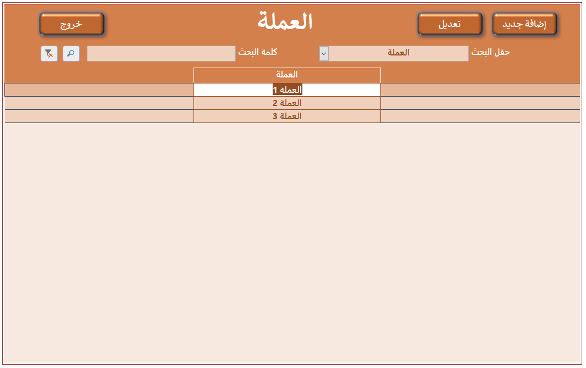
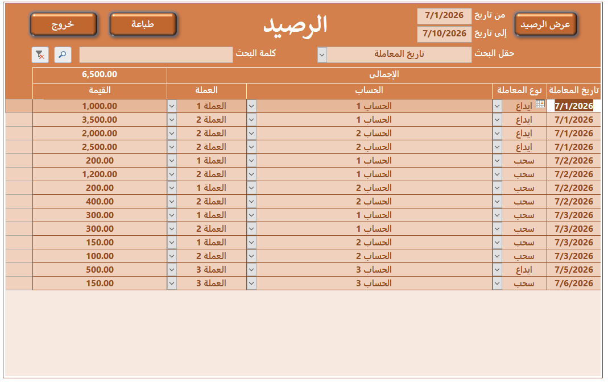
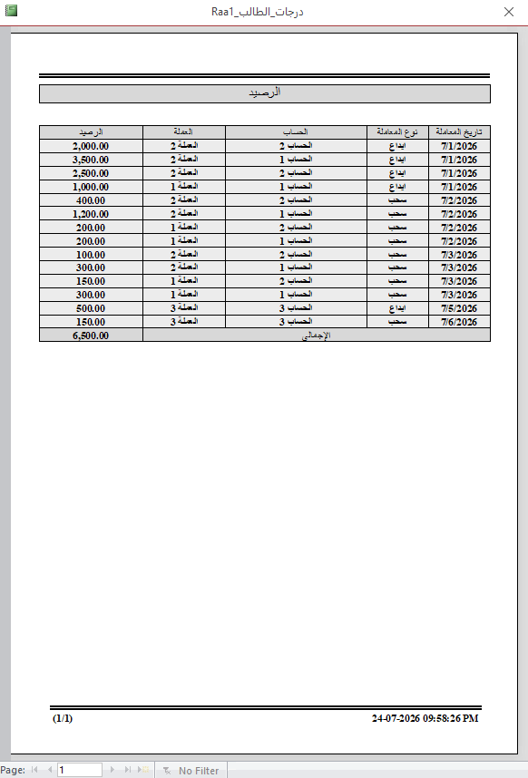

<h2 align="center">2- رصيد الحساب</h2>

  يتم تسجيل الحساب والعملة. ثم يتم تسجيل معاملات السحب والإيداع لكل حساب طبقا لعملته. يتم حساب الرصيد الحالى لكل حساب فى أى فترة زمنية. يمكن طباعة تقرير للرصيد الحالى ومعاملاته.

<h3 align="center">
  عرض فيديو استخدام قاعدة البيانات من اليوتيوب
   
  <a href="https://www.youtube.com/watch?v=8VYJAS0LmSY&t=3s">https://www.youtube.com/watch?v=8VYJAS0LmSY&t=3s</a>
</h3>

<h3 align="center">
  صور قاعدة البيانات
</h3>

  
  
  
  
  
  
  
  
 
 
  

