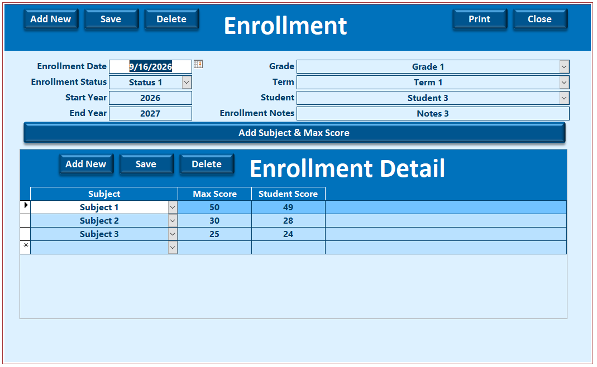

<h1 align="center">Full Access Databases<h1/>

Previewing all databases created on Access Database

  
  
<h2 align="center">
  <a href="./2_Account_Balance"> 2- رصيد الحساب</a>
</h2>
<h2 align="center">
  <a href="./1b_Student_Score_English"> 1b- Student Score</a>
</h2>
<h2 align="center">
  <a href="./1_Student_Score"> 1- درجات الطالب</a>
</h2>
 
 
  

